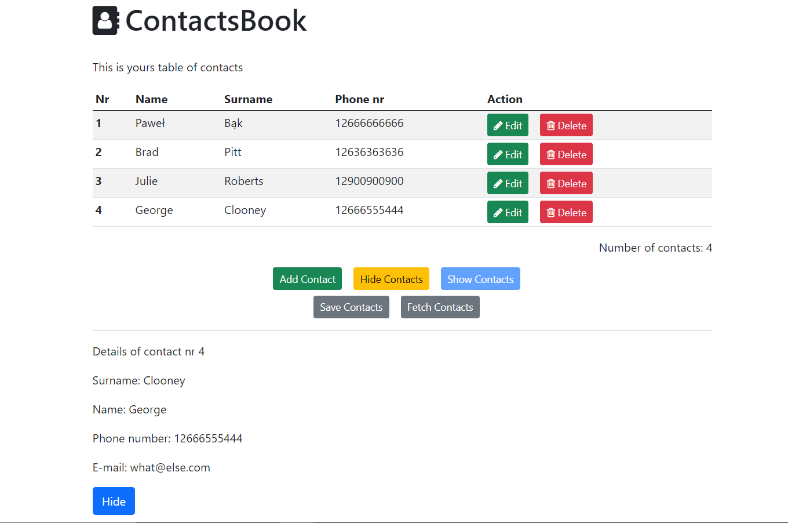

# ContactsBook - Contacts Book Angular App

##### Created with Angular, Bootstrap, Firebase and FontAwesome

## Introduction

This is full CRUD application created for practice Angular.
You can fetch contacts from firebase database, edit, delete each of them and create a new one.
Some fields are not required and visible in table, thats why you should check 'contact details'
\*For demo purposes, saving contacts to firebase is blocked.

##### App is fully responsive

## Built with

Project is created with:

- Angular 11.2.14
- Bootstrap 5.0
- FontAwesome 4.7

## Features

- fetching data from firebase database
- create new contact
- edit existing contact
- delate contacts
- hide contacts
- show hidden contacts
- show more details about contact
- hide contact details
- added some subtle animations during showing table and removing contacts

## Screenshots

## Launch

### Live Demo

You can see deployed live demo [_here_](https://contact-book-6d19e.firebaseapp.com)

### Development server

Clone this repo to your desktop and run `npm install` to install all the dependencies.
Run `ng serve` for a dev server. Navigate to `http://localhost:4200/`.

## To-do

- sign up and log in page
- firebase authentication with google account.
- subtle animations

## Contact

Created by [@PawelBak](https://pawel-bak-portfolio.web.app/) - feel free to contact me!
